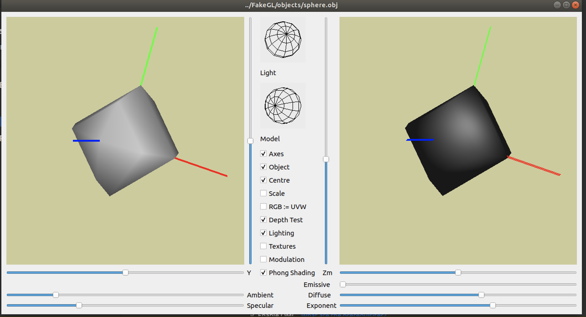

#FakeGL

FakeGL is my coursework in order to know the details for opengl.

# Compile 
To compile on OSX:
Use Homebrew to install qt

qmake -project QT+=opengl
qmake
make

To compile on Windows:
Unfortunately, the official OpenGL on Windows was locked at GL 1.1.  Many many hacks exist, and they all disagree.
Just to make it worse, the Qt response to this is clumsy.  Net result: there is no easy way to get this compiling on Windows.
I will aim to update these instructions at a later date.

# Run
To run on linux

./FakeGLRenderWindowRelease ../path_to/model.obj ../path_to/texture.ppm

To run on OSX:
./FakeGLRenderWindowRelease.app/Contents/MacOS/FakeGLRenderWindowRelease  ../path_to/model.obj ../path_to/texture.ppm

### Preview 

##### the left window is original opengl 
##### the right one is the software opengl

##### Texture preview

##### the right one implements the phong-shading in fragment shader process
